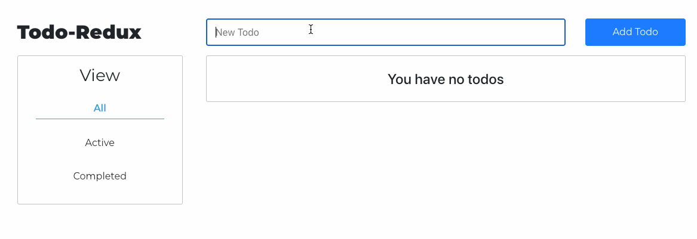

# Todo List - React & Redux

> - Maintained by: `cherie-pavicoTsukayama`

## Description
A React and Redux application for users to keep track of their todos for the day.

## Technologies Used
- React.js
- Redux
- Bootstrap 4
- HTML5
- CSS3

## Live Demo
https://todo-redux.cheriepavico.com/

## Features
1. User can add a todo
1. User can toggle a todo complete
1. User can toggle a todo incomplete
1. User can view all todos
1. User can view active todos
1. User can view completed todos
1. User can delete a todo
1. User can edit a todo

## Preview


## Getting Started
1. Create a new repository.
1. Install <a href="https://reactjs.org/docs/create-a-new-react-app.html#create-react-app">create-react-app.</a>
   ```shell
   npx create-react-app name-of-app
   ```
1. Install <a href="https://redux.js.org/introduction/installation">Redux.</a>
   ```shell
   npm install redux
   ```
1. Start the project. Once started you can view the application by opening http://localhost:3000 in your browser.
   ```shell
   npm run start
   ```
1. Follow the Redux <a href="https://redux.js.org/basics/basic-tutorial"> Basic Tutorial</a> to build the Todo App.
1. Use bootstrap & CSS to style the app.

### Challenge
1. Challenge yourself to create feature 7.
1. Challenge yourself to create feature 8 by creating a new component and using the connect, mapStateToProps, and mapDispatchToProps methods.
